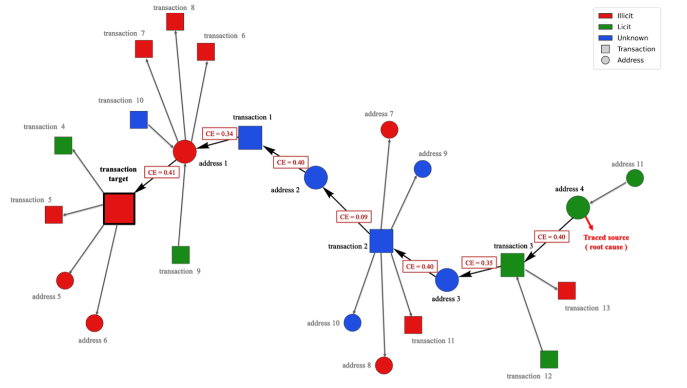
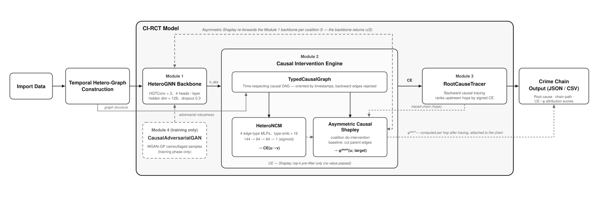
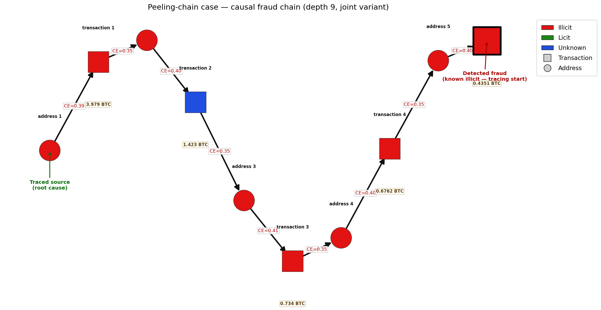

# CI-RCT

**以因果干預進行異質圖上的根因追溯。**

English version: [README.md](README.md)

圖神經網路擅長標記異常,但對於接下來那個問題——**這件事從哪裡開始?是誰造成的?**——回答能力明顯不足。

CI-RCT(Causal Intervention-based Root Cause Tracing)補上後半段。給定一個被標記為異常的節點,它沿著時序尊重的有向圖**反向**回溯,過程中自由跨越不同節點型別,直到抵達證據所指向的來源實體,並為每一跳附上因果依據。產出的是一條**人可以稽核的鏈**,而不是一張顯著性熱圖。



*一次追溯的結果。有標註的邊是追溯器選出的鏈,灰色的則是它在每一跳捨棄掉的其他選項。此例取自用於實證的比特幣資料集——方法本身則定義在任何具型別、具時序的異質圖之上。*

## 運作原理

核心想法是把**相關性**換成**干預**。GNNExplainer、PGExplainer 這類方法問的是「哪個子圖與這個預測最相關」;CI-RCT 問的是「如果我切斷這條邊,預測會怎麼變」——也就是逐邊套用 Pearl 的 do-calculus。

四個模組。GAN 僅在訓練階段運作,推論時不介入。



| 模組 | 職責 |
|------|------|
| **一・異質圖骨幹網路** | HGT 逐關係注意力,產生節點表徵與偵測 logits |
| **二・因果干預引擎** | 建構帶時間戳的型別化因果 DAG;以父邊切斷估計逐邊因果效應;以聯盟介入計算非對稱因果 Shapley 歸因 |
| **三・根因追溯器** | 依因果效應反向回溯至根因,具四項停止條件 |
| **四・因果對抗生成網路** | 僅訓練階段:在 DAG 約束下生成偽裝異常樣本以強化偵測(WGAN-GP) |

模組二輸出兩個職責不同的訊號。**CE**(逐邊因果效應)負責對上游候選排序、驅動追溯;**φ**(非對稱因果 Shapley,以骨幹網路上的聯盟介入計算)負責量化各上游節點所負的局部因果責任。簡言之:**CE 負責追溯,φ 負責解釋。**

有兩項設計讓追溯出的鏈站得住腳。其一,邊依時間戳定向,且因果圖會**直接拒絕任何會讓「因晚於果」的邊**,因此一條鏈不可能逆著時間走。其二,歸因採用滾動讀出,使距離超出骨幹感受野的節點仍能取得可量測的數值,而不會塌陷為零。

## 這個方法對圖的要求

CI-RCT 並不綁定特定領域。它的操作對象是一個滿足下列五項條件的 PyG `HeteroData`:

1. **至少兩種節點型別**——跨型別追溯正是本方法的重點;同質圖會讓它退化為一般的反向搜尋。
2. **具時間戳的有向邊**,且構成時序尊重的 DAG。
3. **目標節點型別上有異常標籤。**
4. 各型別具備**節點特徵向量**。
5. **根因判準可被操作化**——需要一套規則,能判定某個追溯終點是否算命中。

本 repository 提供的是 **Elliptic++ 的實作實例**。要轉移到其他領域,需要撰寫的是:一個回傳 `HeteroData` 與目標型別的 loader,以及對應條件 5 的 ground truth 建構器。**四個模型模組、追溯器與評估流程皆不需更動。**

## 在 Elliptic++ 上的實證

比特幣詐欺對這個方法而言是個嚴苛的測試場域:圖中兩種節點型別是真正交替出現的(交易與錢包位址)、金流讓邊具備明確的方向與時序,而真正掌控資金的實體通常距離被標記的那筆交易好幾跳之遠。

本框架在四個維度上進行評估——偵測效能、根因追溯、解釋品質,以及輸入擾動下的歸因穩定性——並涵蓋三個共用同一張圖與同一套解釋機制的訓練變體(`transaction`、`wallet`、`joint`)。

> 各指標的定義、ground truth 的建構方式與量化結果均於論文中報告。重現這些結果所需的一切均已包含在本 repository 中。

### 追溯出來的鏈,真的有意義嗎?

反向走訪一定會走出**某一條**路徑。真正的問題是:它走出來的東西,是不是稽核人員看得懂的結構?

有兩點支持它是。追溯器是在**做選擇**而非隨波逐流——每一跳都會把所有可用的上游鄰居依因果效應排序後取最強者;上方圖中那些灰色分支,就是它當下考慮過但捨棄掉的候選。而它產生的鏈,與文獻中已有記載的洗錢手法對得上。

**實例——剝離鏈(peeling chain)。** 剝離鏈是比特幣洗錢中廣為人知的手法:一筆大額資金經由一連串交易搬移,每次「剝下」一小筆送往服務商或交易所,主體金額則轉入全新的找零位址;重複數次後,人工追查便極為繁瑣。

下面這條鏈是在**完全不知道有這種手法**的前提下產生的——模型只是沿著因果效應往上游走。而結果具備剝離鏈的完整特徵:交易與位址在九跳中**嚴格交替**、時間戳沿金流方向**單調不減**、轉帳金額**逐跳遞減**(3.979 → 1.423 → 0.734 → 0.676 → 0.435 BTC)。



這條鏈可以被當成一個**場景**來閱讀,而不只是一串節點編號:資金自追溯到的源頭流出,沿途逐跳被拆分縮小,最終抵達那筆被標記出來的交易。

> Elliptic++ **並無手法類型標註**,因此這是一次**結構簽名比對**——該鏈**與**剝離鏈模式**一致(consistent with)**,而非被證實為剝離鏈。比對條件實作於 `scripts/typology_scan.py`。

## 後續研究方向

- **第二領域驗證。** 下一步是找一個結構相同但語義不同的領域。目前的候選集中在製造與製程控制(Tennessee Eastman、PHM 2018 ion mill etch、Bosch 產線),此時追溯目標由交易換成故障的零件或機台。**評估中,尚未定案。**
- **Loader 貢獻。** 任何滿足上述五項條件的資料集,都可以在不更動模型程式碼的前提下接進來。
- **檢視器。** 擴大解釋層的覆蓋範圍,並提供線上示範。

## 環境需求

### 硬體

訓練與評估環境為 **NVIDIA RTX PRO 6000 Blackwell(96 GB)**。

論文所報告的設定會將全部 287 萬條錢包→錢包邊常駐記憶體,這是記憶體用量的主要來源。**以 CPU 訓練並不實際。**

### 軟體

- Python 3.10 以上
- PyTorch 2.0+ 與 PyTorch Geometric 2.4+
- Node.js 18+(僅檢視器需要)

## 安裝

```bash
git clone <repo-url>
cd CI-RCT
pip install -r CI-RCT/requirements.txt
```

> **請先安裝 PyG 的擴充套件。**
> `torch-scatter` 與 `torch-sparse` 是針對特定 torch 版本編譯的。若版本不匹配,`import torch_geometric` 會直接 **segfault 而不是拋出例外**。請依
> [PyG 官方說明](https://pytorch-geometric.readthedocs.io/en/latest/install/installation.html)
> 安裝對應你 torch 與 CUDA 版本的套件。`run_pipeline.py` 會在啟動任何長時間工作前先驗證這一點。

### 資料集

本專案不轉散布 Elliptic++。請[自行下載](https://github.com/git-disl/EllipticPlusPlus)並依下列結構放置:

```
CI-RCT/data/Elliptic++/
  txs_features.csv       txs_classes.csv       txs_edgelist.csv
  wallets_features.csv   wallets_classes.csv
  AddrTx_edgelist.csv    TxAddr_edgelist.csv   AddrAddr_edgelist.csv
```

## 使用方式

一個指令跑完全部——訓練、評估、金流鏈匯出、檢視器建置,論文設定已預先套用。

```bash
cd CI-RCT

python run_pipeline.py --dry-run        # 顯示執行計畫,不動任何東西
python run_pipeline.py --device cuda    # 完整執行,三個變體
```

產物已存在的階段會自動跳過,因此重複執行成本很低:

```bash
python run_pipeline.py --from evaluate  # 沿用既有 checkpoint
python run_pipeline.py --force evaluate # 重跑某階段及其所有下游
python run_pipeline.py --only frontend  # 只重建檢視器
```

### 產出內容

```
checkpoints/ci_rct_elliptic++[_變體]_best.pt
viz/crime_chains[_變體].json     追溯鏈、逐節點 φ、特徵歸因
results/crime_chains.csv         一列一條鏈
results/chain_neighbors.json     一階鄰居覆蓋層
frontend_temp/dist/              自帶資料的靜態檢視器
```

### 單獨執行各階段

```bash
python train.py    --dataset elliptic++ --variant joint --epochs 400 --use_gan true
python evaluate.py --dataset elliptic++ --checkpoint <路徑>
python infer.py    --dataset elliptic++ --checkpoint <路徑> --target_node <索引>
```

執行 `run_pipeline.py --dry-run` 會印出它將執行的完整指令(含所有旗標),這是查看完整設定最方便的方式。

## 可解釋性檢視器

`frontend_temp/` 是以 React + Vite 實作的金流鏈檢視器,採三層呈現:以圖呈現金流鏈(L1)、逐節點貢獻長條圖(L2),以及責任樞紐節點上的逐特徵因果歸因(L3)。

```bash
cd CI-RCT/frontend_temp
npm install
npm run dev       # 開發模式,資料重產後自動反映
npm run build     # 產出 dist/,資料一併打包
```

## 專案結構

```
CI-RCT/
  run_pipeline.py      一鍵流程入口
  pipeline/            階段圖、凍結設定、前置檢查
  train.py             訓練(Phase 1 無 GAN / Phase 2 WGAN-GP)
  evaluate.py          四維度評估與金流鏈匯出
  infer.py             單圖推論
  model/               四個模組
  utils/               載入器、因果圖建構、評估指標
  configs/config.py    凍結的超參數設定
  scripts/             消融實驗驅動、繪圖與匯出工具
  tests/               pytest 測試套件
  frontend_temp/       可解釋性檢視器
```

## 測試

```bash
cd CI-RCT
pytest tests/
```

## 引用

若您在研究中使用本專案,請引用本論文。

**APA 第七版(中文)**

> 施宇鴻(2026)。*CI-RCT:基於因果干預之異質圖可解釋根因追溯研究*〔碩士論文,淡江大學〕。淡江大學機構典藏。<!-- TODO: 論文網址 -->

**APA 7th (English)**

> Shih, Y. (2026). *CI-RCT: Explainable root cause tracing on heterogeneous
> graphs based on causal intervention* [Master's thesis, Tamkang University].
> Tamkang University Institutional Repository. <!-- TODO: thesis URL -->

**BibTeX**

```bibtex
@mastersthesis{shih2026circt,
  title   = {{CI-RCT: Explainable Root Cause Tracing on Heterogeneous Graphs Based on Causal Intervention}},
  author  = {Shih, Yuhung},
  school  = {Tamkang University},
  type    = {Master's thesis},
  address = {New Taipei City, Taiwan},
  year    = {2026},
  url     = {TODO}
}
```

## 授權

本專案採用 [MIT License](LICENSE) 釋出。第三方組件適用其各自的條款,詳見 [NOTICE](NOTICE)。
